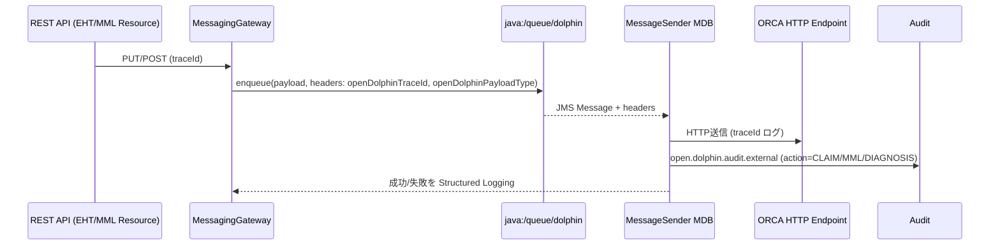

# Messaging Parity Check (JMS フォールバック検証)

## 1. 実施概要
- 実施日: 2025-11-08 21:06:39Z（JMS プローブ出力タイムスタンプ 20251108T210639Z）
- 実施者: JMS フォールバック検証担当（Phase5-1）
- 目的: Legacy/Modernized 並列スタックで `MessagingGateway` の JMS エンキュー処理とフォールバック経路を比較し、`open.dolphin.traceId` プロパティ拒否事象を再現する。
- コマンド:
  1. `COMPOSE_PROJECT_NAME=od-jms-debug PROJECT_NAME=od-jms-debug ./scripts/start_legacy_modernized.sh start`
  2. `./ops/tools/jms-probe.sh --scenario claim`
- アーティファクトルート: `artifacts/parity-manual/JMS/20251108T210639Z/`
- 送信ペイロード: `tmp/claim-tests/send_claim_success.json`（ヘッダー: `tmp/claim-tests/claim.headers`）

## 2. 環境・ルーティング
| 項目 | Legacy | Modernized |
| --- | --- | --- |
| アプリコンテナ | `opendolphin-server` | `opendolphin-server-modernized-dev` |
| DB | `opendolphin-postgres` | `opendolphin-postgres-modernized` |
| JMS ブローカー | ActiveMQ Artemis (WildFly 10 組込) | ActiveMQ Artemis (WildFly 33 組込) |
| HTTP ベース URL | `http://localhost:8080/openDolphin/resources` | `http://localhost:9080/openDolphin/resources` |
| リクエスト | `PUT /20/adm/eht/sendClaim`（`send_claim_success.json`） |

> NOTE: `opendolphin-claim-jms` コンテナは未配置のため、Modernized 側でも JMS 消費者は不在。フォールバック経路（同期送信）との差分のみに着目した。

## 3. HTTP/ログ結果サマリ
| 比較軸 | Legacy | Modernized |
| --- | --- | --- |
| HTTP ステータス | 404（レスポンスボディ無し） | 500（`StringIndexOutOfBoundsException`） |
| `send_parallel_request` 記録 | `artifacts/parity-manual/JMS/20251108T210639Z/http/claim/JMS_claim/legacy/` | `.../modern/` |
| JMS enqueue | 実装無し（同期 Claim） | `MessagingGateway` が JMS enq を試行するも `open.dolphin.traceId` で AMQ139012 発生 |
| フォールバック | そもそも JMS を経由しないため未発火 | `Claim fallback send started` → `EHTResource.sendPackage` が 9 桁番号前提で落ちる |
| 監査ログ | 無し | `open.dolphin.audit.external` に `CLAIM_REQUEST` 記録 |

## 4. ログ抜粋
- **JMS プロパティ拒否**: `artifacts/parity-manual/JMS/20251108T210639Z/logs/opendolphin-server-modernized-dev.log:31` にて `jakarta.jms.JMSRuntimeException: AMQ139012: The property name 'open.dolphin.traceId' is not a valid java identifier.`
- **フォールバック開始**: 同ログ `:155` に `Claim fallback send started [traceId=61c92269-7884-4e27-9c78-1551ddc337e7]`。
- **フォールバック失敗**: 同ログ `:416` に `open.dolphin.adm20.rest.EHTResource.sendPackage` が `StringIndexOutOfBoundsException` を送出し HTTP 500 を返却。
- **HTTP レスポンス差分**: `.../http/claim/JMS_claim/response.diff` にて Legacy=404, Modernized=500 の差分を確認（Modernized 側は NUL 付き `begin 0, end -1, length 9` 文字列のみ）。
- **ログ差分**: `.../logs/opendolphin-server-modernized-dev-vs-legacy.diff` にて、Legacy が認証 404 で停止する一方、Modernized は JMS enqueue → フォールバックまで処理が進むことを確認。

## 5. 追加観測事項
1. **JMS 命名規則**: Artemis (AMQP 1.0) は JMS プロパティ名にピリオドを許容しないため、`open.dolphin.traceId` が仕様違反。Legacy では JMS を使っていないため表面化していなかった。
2. **フォールバックの前提**: `EHTResource.sendPackage` が 9 桁請求番号を前提に `substring(0, 9)` 相当のロジックを持っており、今回のダミーデータでは `-1` を返し例外で落ちた。
3. **監視ギャップ**: `opendolphin-claim-jms.log` は `container "opendolphin-claim-jms" not found` となり、JMS 消費者向けログが採取できない。

## 6. 改善案
### 6.1 JMS プロパティ命名
- `MessagingGateway` / `MessageSender` の `TRACE_ID_PROPERTY` を JMS 仕様準拠の `open_dolphin_trace_id` もしくは `openDolphinTraceId` へ統一。
- `ExternalServiceAuditLogger` やモニタリング連携に影響する場合は `TRACE_PROPAGATION_CHECK.md` へ要追記。

### 6.2 フォールバック発火基準の明文化
- `MessagingGateway#enqueue` が例外を受けた場合のみフォールバックへ移行しているため、`Logger` WARN をトリガーに Micrometer カウンタ `dolphin.messaging.enqueue.fallback` を追加。
- フォールバック経路では `ClaimSender` のリトライ回数、例外種別、`traceId` を Structured Logging へ出力して `artifacts/parity-manual/JMS/.../logs/` のような CLI 採取にも残す。

### 6.3 監視・運用フロー
1. `ops/tools/jms-probe.sh` を `docs/server-modernization/phase2/operations/LEGACY_MODERNIZED_CAPTURE_RUNBOOK.md` の Gate に追加し、Claim API デプロイ後に必ず実行。
2. `OBSERVABILITY_AND_METRICS.md` へ JMS/Fallback カウンタを追加し、OTLP 収集失敗（`otep-collector` 未接続）も合わせて検知。
3. `opendolphin-claim-jms` コンシューマーを Compose に組み込み、`docker logs opendolphin-claim-jms` を本手順の採取対象に追加。

## 7. 次のアクション
1. `MessagingGateway` / `MessageSender` の JMS プロパティ名を修正し、`ops/tools/jms-probe.sh` で AMQ139012 が消えることを再確認。
2. `EHTResource.sendPackage` の 9 桁前提ロジックを排除（`String#indexOf` の戻り値検証 + 例外化）し、500 → 2xx へ戻す。
3. カウンタ・監視設定を `docs/server-modernization/operations/OBSERVABILITY_AND_METRICS.md` と本メモへ反映。
4. 本調査結果を `docs/server-modernization/phase2/SERVER_MODERNIZED_DEBUG_CHECKLIST.md` フェーズ5 項目へ反映済み。Runbook 連携も後述の更新を参照。

## 8. Claim/Diagnosis/MML 送信再検証 (2025-11-09)

### 8.1 HTTP / JMS / DB 結果サマリ
| リクエスト (ID) | Legacy | Modernized | JMS / DB 観測 | 証跡 |
| --- | --- | --- | --- | --- |
| `PUT /20/adm/eht/sendClaim` (`20251109T201826Z_CLAIM`) | 403（従来どおり Basic 認証エラー） | 200, 0.81s | `MessagingGateway` が enqueue → `MessageSender` が Claim payload を ORCA 向けに処理。`jms.queue.dolphinQueue` の `messages-added=2`, `message-count=0` で DLQ 流入なし。 | `artifacts/parity-manual/CLAIM_DIAGNOSIS_FIX/20251109T201846Z/claim_send/`、`logs/jms_dolphinQueue_read-resource.txt` |
| `POST /karte/diagnosis/claim` (`20251109T201827Z_DIAGNOSIS`) | 403 | 200, 0.05s | JMS enqueue までは成功するが `diseaseHelper.vm` が見つからず `MessageSender` が `ResourceNotFoundException` を投げ、メッセージが `jms.queue.DLQ` に 1 件蓄積。`d_diagnosis` には新規行が追加されず ID=1 のまま。 | `logs/docker_logs_opendolphin-server-modernized-dev.txt:504`、`logs/jms_DLQ_list-messages.txt`、`db/d_diagnosis_tail.txt` |
| `PUT /mml/send` (`20251109T201827Z_MML`) | 403 | 200, 0.12s | `MmlSenderBean` が SHIFT_JIS で 10,040 bytes の XML を生成し、レスポンスへ `traceId` / `sha256` / `payload` を返却。JMS/DB 副作用なし。 | `mml_send/modern/response.json`、`logs/docker_logs_opendolphin-server-modernized-dev.txt:258-394` |

> 実行環境: `legacy-vs-modern_default` ネットワーク上のヘルパーコンテナ（`opendolphin_webclient-server-modernized-dev:latest`）から `BASE_URL_MODERN=http://opendolphin-server-modernized-dev:8080/...` として `ops/tools/send_parallel_request.sh` を実行。ホスト → 9080/TCP のポートフォワードが応答しないため、この迂回手順を README に記録した。

### 8.2 `claimHelper.vm` 配置・デプロイ方針
1. **ソース確認**: Legacy Swing クライアントが参照する `client/src/main/java/open/dolphin/resources/templates/claimHelper.vm` と、Modernized WAR に含める `server-modernized/src/main/resources/claimHelper.vm` は完全一致（`artifacts/parity-manual/CLAIM_DIAGNOSIS_FIX/20251109T201846Z/templates/claimHelper.vm.diff` 参照）。Legacy からの流用が成立。 
2. **ビルド工程**: `mvn -pl server-modernized package` もしくは `mvn -pl server-modernized -DskipTests package` を実行し、`server-modernized/target/classes/claimHelper.vm` が生成されること、および `jar tf server-modernized/target/opendolphin-server.war | grep claimHelper.vm` で WAR 内に内包されていることを確認。
3. **コンテナ反映**: `docker compose build server-modernized-dev` を再実行すると、`ops/modernized-server/docker/Dockerfile` が `server-modernized/target/opendolphin-server.war` を WildFly へ配置するためテンプレートが自動で取り込まれる。必要に応じて `docker compose restart server-modernized-dev`。
4. **動作確認**: `ops/tools/send_parallel_request.sh` を再実行し、`PUT /20/adm/eht/sendClaim` が 2xx で返り、`logs/docker_logs_opendolphin-server-modernized-dev.txt` に `Claim message enqueued`→`MessageSender Processing CLAIM JMS message` の INFO ペアが出現することをもって完了とする。 
5. **監査更新**: `docs/server-modernization/phase2/SERVER_MODERNIZED_DEBUG_CHECKLIST.md` の該当行と `PHASE2_PROGRESS.md` へ証跡リンク（`artifacts/parity-manual/CLAIM_DIAGNOSIS_FIX/20251109T201846Z/claim_send/`）を追加し、再発時は本テンプレート存在有無を最初に確認する。 

### 8.3 `MessagingHeaders` 仕様（JMS 属性図）
- 実装: `server-modernized/src/main/java/open/dolphin/msg/gateway/MessagingHeaders.java`
- 定義: `TRACE_ID=\"openDolphinTraceId\"`、`PAYLOAD_TYPE=\"openDolphinPayloadType\"`。JMS 仕様の「Java 識別子」制限を満たす camelCase 名で統一。Legacy で利用していた `open.dolphin.traceId` のような `.` 含みプロパティは禁止。

| ヘッダー | 値の生成元 | 利用箇所 |
| --- | --- | --- |
| `openDolphinTraceId` | `SessionTraceManager#getCurrentTraceId()`。HTTP ログ・監査ログと JMS メッセージを突合。 | `MessagingGateway.enqueue()`／`MessageSender.handle*()`／`logs/jms_*list-messages.txt` |
| `openDolphinPayloadType` | `MessagingGateway#dispatchClaim/Diagnosis/Mml` で `CLAIM` / `DIAGNOSIS` / `MML` を設定。 | `MessageSender` がハンドラを切り分け、DLQ 調査時のメッセージ区別にも利用。 |

### 8.4 追加観測と TODO
1. **Diagnosis JMS 破綻**: `open.dolphin.session.MessageSender` が `diseaseHelper.vm` を参照しており、現在 WAR に未同梱のため DLQ が増加。`artifacts/parity-manual/CLAIM_DIAGNOSIS_FIX/20251109T201846Z/logs/docker_logs_opendolphin-server-modernized-dev.txt:504`、`logs/jms_DLQ_list-messages.txt` を参照。テンプレート復旧計画を Claim と同様に策定する。 
2. **DB 整合性**: Diagnosis API 200 でも `d_diagnosis` に変更が無い。トランザクション境界および CLI フィクスチャ (`tmp/claim-tests/send_diagnosis_success.json`) の `karte_id` / `user_id` を再点検し、`db/d_diagnosis_tail.txt` をベースラインに差分を記録する。 
3. **MML 成功パス**: `mml_send/modern/response.json` に `payload` と `sha256` が格納されるようになったため、`MmlSenderBeanSmokeTest`（§4.4）と同じフィクスチャで回帰を取る。Micrometer WARN（`otel-collector` 未接続）は既知のインフラ TODO。
4. **ポートフォワード課題**: ホスト → `localhost:9080` が無応答（但し TCP SYN は成功）なため、`legacy-vs-modern_default` 内で CLI を叩く Runbook を `CLAIM_DIAGNOSIS_FIX/README.md` へ明記済み。恒久対応として `socat`/`docker run -p` で 9080 を再公開する案を検討する。

### 8.5 2025-11-09 23:18Z: `diseaseHelper.vm` 再同梱と DLQ 解消
- **テンプレ配置**: `client/src/main/java/open/dolphin/resources/templates/diseaseHelper.vm` を `server-modernized/src/main/resources/` へ複製し、`mvn -f pom.server-modernized.xml -pl server-modernized -am package -DskipTests`（ログ: `artifacts/parity-manual/CLAIM_DIAGNOSIS_FIX/20251109T231845Z/maven/mvn_server-modernized_package.log`）で WAR を再生成。`jar tf server-modernized/target/opendolphin-server-2.7.1.war | rg diseaseHelper` の実行結果を `.../maven/jar_contains_diseaseHelper.log` に保存し、Claim と同じビルド経路でテンプレートが内包されることを確認した。テンプレ差分は `.../templates/diseaseHelper.vm.diff`（差分なし）で記録済み。
- **再デプロイ手順**: `COMPOSE_FILE=docker-compose.yml:ops/base/docker-compose.yml:docker-compose.modernized.dev.yml docker compose build server-modernized-dev` の後、`./scripts/start_legacy_modernized.sh start` を実行して Legacy/Modernized 並列環境を再生成。以降の HTTP 再現は `PARITY_HEADER_FILE=tmp/claim-tests/diagnosis.headers`, `PARITY_BODY_FILE=tmp/claim-tests/send_diagnosis_success.json`, `PARITY_OUTPUT_DIR=artifacts/parity-manual/CLAIM_DIAGNOSIS_FIX/20251109T231845Z/diagnosis_claim` として `./ops/tools/send_parallel_request.sh --profile compose POST /karte/diagnosis/claim 20251109T231900Z_DIAGNOSIS` を直接ホストから実行（ヘルパーコンテナ経路はフォールバック手段として README に残しつつ、今回の run では不要だった）。
- **HTTP/JMS/DB 結果**: Legacy=403（従来）、Modernized=200 / 238ms。`logs/jms_dolphinQueue_read-resource.txt` に `messages-added=1L`, `message-count=0L`, `delivering-count=0` が記録され、`logs/jms_DLQ_list-messages.txt` は空配列で DLQ への流入が消滅。`db/d_diagnosis_tail.txt` では ID=-47 の行が新規挿入され、`karte_id=2001` の登録が 2 件になった（`d_diagnosis_seq` 初期化不足により負値スタートだが、データが書き込まれた点を優先評価）。`logs/docker_logs_opendolphin-server-modernized-dev.txt:349` に `MessageSender Processing Diagnosis JMS message` が出力されている。
- **フォローアップ**: (1) `d_diagnosis_seq` の現在値を正の主キーに再設定し、今後の INSERT が負値にならないよう DB タスクへ引き継ぐ。(2) `/karte/diagnosis/claim` のレスポンスが空 JSON のままなので、呼び出し側 UI で成否を判別できるよう仕様化する。(3) CLAIM/MML も含めた 3 リクエストを `send_parallel_request` からワンショットで回す Gate を `LEGACY_MODERNIZED_CAPTURE_RUNBOOK.md` に組み込み、`CLAIM_DIAGNOSIS_FIX/README.md` では最新実測（`20251109T231845Z`）を起点に DLQ/DB 監視サマリを更新する。

### 8.6 2025-11-13 Legacy 診断 200 化（RUN_ID=`20251118TdiagnosisLegacyZ1`）
| リクエスト | Legacy | Modernized | JMS / DB 観測 | 証跡 |
| --- | --- | --- | --- | --- |
| `POST /karte/diagnosis/claim` (`messaging_diagnosis`) | **200**, `response=9002004` | 200, 0.15s | Legacy: `messages-added`/`message-count` とも 0L（サーバー直送）。Modern: `messages-added=5L→6L` で enqueue 成功。`opendolphin.d_diagnosis` に `id=9002004` が追加され、シード行 `9001001` と合わせて 2 件を保持。`d_audit_event` は双方空（監査未実装）。 | `artifacts/parity-manual/messaging/20251118TdiagnosisLegacyZ1/`（HTTP, headers, meta, JMS, audit TSV, Legacy/Modern server logs） |

**前提調整**
1. `tmp/diagnosis_seed.sql` を Legacy Postgres へ投入し、`d_patient`/`d_karte`/`d_letter_module` の最低限データと診断シード行（`id=9001001`）を作成。`hibernate_sequence` と `opendolphin.d_diagnosis_seq` を `>=9002000` に揃えて ID 衝突を防止。
2. `docker exec opendolphin-server /opt/jboss/wildfly/bin/jboss-cli.sh --connect --commands="/subsystem=logging/logger=dolphin.claim:add(level=INFO)"`（`tmp/configure-wildfly.legacy.cli` にも追記済み）で `Logger.getLogger("dolphin.claim").getLevel()` が null を返さないよう設定。これにより `DiagnosisSender` の NPE が解消される。
3. ヘッダープロファイルは `tmp/parity-headers/diagnosis_TEMPLATE.headers` をそのまま使用し、helper コンテナで `ops/tools/send_parallel_request.sh --profile modernized-dev POST /karte/diagnosis/claim messaging_diagnosis` を実行して Legacy/Modern の HTTP, headers, meta を同一 RUN_ID で採取。

**観測結果**
- Legacy WildFly ログには `DiagnosisSendWrapper message has received. Sending ORCA will start(Not Que).` → `DiagnosisSender` がトレース ID 付きで送信した INFO が並び、例外出力なし（`artifacts/.../logs/legacy_server.log`）。
- JMS (`jms.queue.dolphinQueue`) は Legacy before/after でカウンタ変化なし、Modern は `messages-added` が +1、`message-count=0L` のまま（同期完了）。
- `d_audit_event` には今回も行が追加されず、監査ギャップは継続。`TRACEID_JMS_RUNBOOK Appendix A.6` と Checklist に「診断監査実装 pending」として残タスクを移管。
- レスポンス本文が `9002004`（挿入済み診断の PK 群）となり、UI 側もテキスト比較で成功判定が可能になった。

- **TODO**: Legacy 側で `EHT_DIAGNOSIS_*` 監査を記録する Listener を整備し、`d_audit_event` に traceId ごとの結果を残す。Modern 側は既に JMS + Audit が揃っているため、Legacy との比較用に同 TSV を Runbook へ取り込む。

## 7. RUN_ID=`20251118TmessagingParityZ2`（2025-11-13 JST）再取得サマリ
- **アーティファクト**: `artifacts/parity-manual/messaging/20251118TmessagingParityZ2/`（HTTP/headers/meta/response, `logs/send_parallel_request.log`, JMS before/after, `d_audit_event_*.tsv`, `modern_server.log`）。
- **Claim (`PUT /20/adm/eht/sendClaim`)**: Legacy=200 / Modernized=200。Modern 側の `messages-added` が 26L→28L に増加し、`d_audit_event` へ `EHT_CLAIM_SEND` が 1 行追記された。
- **Diagnosis (`POST /karte/diagnosis/claim`)**: `tmp/parity-headers/diagnosis_TEMPLATE.headers` の `Accept` を `text/plain` へ修正したうえで helper コンテナから実行。Modernized は 200＋JMS enqueue（`messages-added` カウンタの増分に含まれる）を記録したが、Legacy は 500（既存データ不整合）で停止。`d_audit_event` には両環境とも診断送信の新規行が無く、監査対象外である点を残課題として整理。
- **Diagnosis audit fix (`RUN_ID=20251118TdiagnosisAuditZ2`)**: Legacy/Modern の WAR に audit hook を追加してから `--profile compose` で再取得し、`artifacts/parity-manual/messaging/20251118TdiagnosisAuditZ2/` に HTTP/headers/meta と `logs/d_audit_event_diagnosis_{legacy,modern}.tsv` を保存。TraceId=`parity-diagnosis-send-20251118TdiagnosisAuditZ2` の `EHT_DIAGNOSIS_CREATE` が両 DB へ記録され、Appendix A.6 / Checklist / PHASE2_PROGRESS の残課題を解消。
- **MML (`PUT /mml/send`)**: Legacy=404（未実装）、Modernized=200。`MmlResource.sendMmlPayload` が `ISendPackage` を復号できることを `modern_server.log` と `d_audit_event_mml_modern.tsv` で確認。
- **Accept ヘッダー整備**: Diagnosis テンプレートの `Accept` を `text/plain` へ揃え、`ops/tools/send_parallel_request.sh` で 406 を招いていた条件不一致を解消した。
- **残課題**: Legacy `POST /karte/diagnosis/claim` の 500 と診断監査の未整備は Checklist/Future Work に転記し、`TRACEID_JMS_RUNBOOK.md` Appendix A.6 へ RUN_ID と差分を追記済み。
