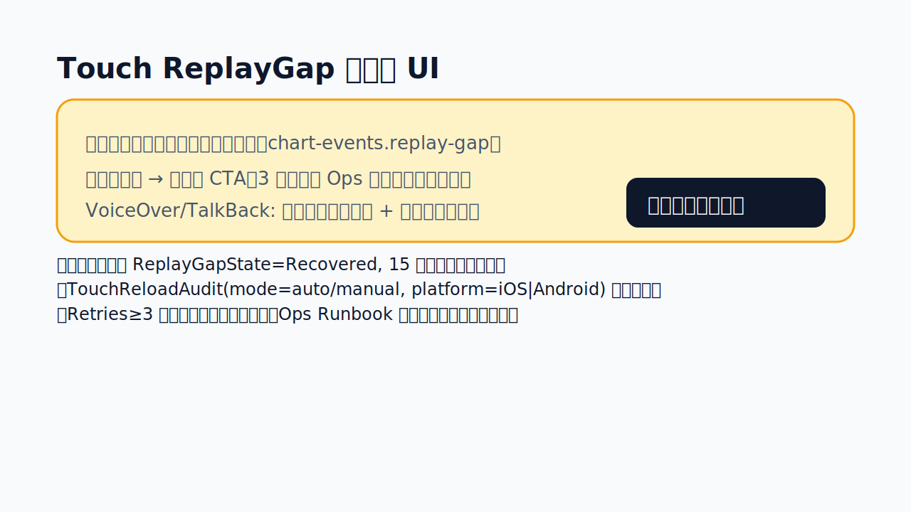

# Web 受付業務マニュアル（暫定版更新: 2026-05-20）

本資料は Web クライアントに移行する受付担当者向けの運用マニュアルです。既存オンプレ（Swing）クライアントとの相違点、日々のオペレーション手順、研修スケジュールをまとめています。正式リリース時には院内ポータルへ転載してください。

## 1. 受付画面の概要

- 画面構成
  - 上部: バーコード受付パネルと「カード表示 / 表形式」切り替え、表示項目設定ボタン。
  - 左: 待機状況サマリ（待機/呼出/診察中の件数）。
  - 中央: 受付患者カード（氏名・受付メモ・安全メモ・状態操作）。
  - 右: 「予約を管理」ボタンから `AppointmentManager` を開く。
- 主な差分
  - 呼出トグルはカルテ排他状況を判定し、診察中の場合は自動で無効化。
  - 受付メモ編集はリアルタイムで他端末へ反映（ChartEvent 経由）。保存後は Swing クライアントとも共有。

## 2. 日次オペレーション手順

1. **受付登録の確認**: ログイン直後に「受付情報を再取得」をクリックし、最新データへ同期。
2. **呼出状態の変更**: 患者カードの「呼出する / 待機に戻す」を利用。診察端末がロック中の場合は警告が表示されるため、医師へ確認。
3. **受付メモ編集**:
   - 「受付メモを編集」から入力し、`保存する` ボタンで確定。
   - 保存後は他端末へ即時反映され、カルテ右ペインの問診メモにも同期。
4. **カルテへの遷移**: 「カルテを開く」を押下すると Web カルテが新規タブで開く。Swing 併用時は排他ルール（同一患者の重複編集禁止）を徹底。

## 3. バーコード受付と一覧カスタマイズ

1. **診察券をスキャン**: 「バーコード受付」パネルの入力欄にフォーカスし、バーコードリーダーで患者の診察券を読み取ります。自動的に患者 ID を抽出し、該当患者が見つかれば `/pvt2` へ受付登録が送信されます。
2. **担当医・保険情報の設定**: 必要に応じて診療科コード／名、担当医コード／名、保険 UUID を入力します。保存が成功すると各値はブラウザのローカルストレージに記憶され、次回スキャン時の初期値として利用されます。
3. **エラー発生時**: 患者が見つからない、もしくはサーバー登録に失敗した場合はパネル下部に赤色のエラーメッセージが表示されます。患者 ID を手入力して再スキャンするか、Swing 版で受付登録を実施してください。

### 一覧表示のカスタマイズ

- **表示形式の切り替え**: コントロールバーの「表示形式」から「カード表示」「表形式」を選択できます。表形式では各患者が行として表示され、担当医・メモなどを横断的に確認可能です。
- **表示項目の設定**: 「表示項目を設定」ボタンでカラム設定ダイアログが開きます。チェックした項目のみがカード/表に表示されます。設定は端末ごとに保存されるため、業務に合わせて調整してください。
- **設定のリセット**: 端末で設定を初期化したい場合はブラウザのローカルストレージから `opendolphin.reception.preferences.v1` を削除し、画面を再読み込みします。

## 4. 予約管理とリマインダー送信

- **予約 CRUD**
  - 「予約を管理」→ `AppointmentManager` で 60 日分の予約を一覧表示。
  - 予約の登録/更新時は日時・メニュー名を入力。重複がある場合はガードメッセージが表示される。
- **リマインダー送信フロー**
  1. 対象予約の「リマインダー」ボタンを押す。
  2. 送信方法（メール or SMS）と送信先を入力。
  3. 必要に応じて本文追記・記録メモを入力し、「件名と本文をコピー」または「メールアプリを開く」で送信。
  4. 実際に送信したら「送信済みを記録」を押下。`/appo` へ PUT され、予約メモ末尾に `【リマインダー】` 形式で履歴が残る。
  5. 最新の履歴は予約カード内に表示され、Swing 側からも確認可能。
- **注意事項**
  - SMS 送信は外部端末を想定。本文コピー後に院内の SMS 端末へ貼り付けて送信し、実施者名をメモ欄へ記録する。
  - 送信先情報は個人情報のため、院内ポリシーに従って権限者のみが操作する。

## 5. 施設全体の予約一覧（PatientSchedule Web）

- 左メニュー「施設予約一覧」から遷移し、施設全体の予定カルテを日付・担当医単位で確認できます。
- フィルタ条件
  - **対象日**: カレンダー入力で当日/前日/翌日の切り替えが可能。ショートカットボタン（前日/翌日/今日）を用意。
  - **担当医**: 予約データの担当医名をもとに絞り込み。
  - **状態**: 待機・呼出中・診察中で絞り込み（オンプレと同じ state 判定）。
  - **キーワード**: 氏名・ID・カナ・メモで部分一致検索。
  - **担当医のみ**: ORCA 担当医コードが設定されている場合 `/schedule/pvt/{orcaId,unassignedId,date}` を呼び出し、本人担当分のみを表示。
    - セッションに ORCA 担当医コードが存在しない場合はチェックボックスが無効化され、「担当医コード未設定」の案内を表示。Swing 版と同じく ORCA ユーザー ID の登録が必要です。
- テーブル操作
  - 行には予定時刻、患者基本情報、担当医/診療科、受付メモ・保険情報、最終カルテ保存日時を表示。
  - 「カルテを開く」で該当 `visitId` を持つ Web カルテへ遷移（別タブ）。
  - 呼出状況に応じて背景色を変更（診察中=濃色、呼出中=淡色）。
- 運用手順（例）
  1. 朝礼前に対象日を当日に設定し、担当医別の予約件数を確認。
  2. 急患枠や呼出中の件数が多い担当医を把握し、受付スタッフ間で分担を調整。
  3. 終業時に翌日へ切り替えて、予約メモの抜けやダブルブッキングを事前チェック。

## 6. `chart-events.replay-gap` 受信時のリロード UX

ChartEvent SSE の履歴が 100 件バッファを超えて欠落した場合、サーバーは `event: chart-events.replay-gap` / `data: {"requiredAction":"reload"}` を単発送信します。Web 受付画面では以下のルールで通知・自動回復を行います。

### 6.1 通知フロー

1. **常時監視**: `ChartEventsProvider` が SSE を購読し、`chart-events.replay-gap` を受信した瞬間に `ReceptionToastStore` へ `type: "warning"` の通知を登録。
2. **バナー表示**: 画面上部に「受付一覧の同期が切断されました。再取得を実行中です。」（黄背景）を常時表示。進捗スピナー付きでユーザーが閉じるまでは消えない。
3. **自動リロード**: 通知受信後すぐに `/api/pvt2/pvtList`（本番は `/rest/pvt2/pvtList`）を 1 回コール。`ClientUUID` ヘッダーは SSE セッションと同一値を利用し、監査ログと突合できるようにする。
4. **成功時の UX**:
   - バナー文言を「受付一覧を再同期しました（hh:mm）」へ更新し 15 秒後に自動クローズ。
   - カード一覧へ最新データを反映後、`ChartEventsProvider` を再接続。`Last-Event-ID` は API 応答の `sequence` を採用。
5. **失敗時の fallback**:
   - バナー下に赤字で「自動再取得に失敗しました（HTTP {{status}}）。`再取得を再試行` を押して手動実行してください。」を表示。
   - CTA ボタン: `再取得を再試行` → `/rest/pvt2/pvtList` を再送。3 回連続失敗で `サポートへ連絡`（`ops@dolphin.example.jp`）リンクを表示し、Runbook 手順 8 への誘導文を併記。
6. **監査ログ**: 自動・手動いずれのリロードも `ReceptionReloadAudit`（`localStorage` バッファ → `/rest/audit/events`）へ `reason=replay-gap` で記録する。

### 6.2 Touch クライアント連携

- Touch 版も同じ SSE 通知を受け取るため、カルテ患者ヘッダーのガイド (`docs/web-client/operations/CHARTS_PATIENT_HEADER_BUTTON_FIX.md#chart-events-replay-gap`) へ本節へのディープリンクを追加。
- Touch 版ではカルテ患者ヘッダーに同じ文言のバナーを表示し、CTA ラベルを `カルテ一覧を再同期` に読み替える。受付側で再取得が成功しても Touch 端末には自動反映されないため、バナーが残る場合は手動再取得を案内する。

### 6.3 運用注意

- `chart-events.replay-gap` を受信した時刻と API レスポンス時刻を日次運用ログへ記録し、Alertmanager 通知との突合に備える。
- ブラウザ再起動後も `ReceptionToastStore` に残った通知を復元し、「最終同期 hh:mm」を確認できるようにする。
- Alertmanager で `ChartEventHistoryRetentionCritical` / `ChartEventHistoryGapDetected` が同時発火した場合は、Runbook SSE 手順に従い Ops と状況共有を行う。

### 6.4 UI ワイヤーフレームと通知バリアント

```
┌──────────── Reception Toast (右下固定) ────────────┐
│ [!] 受付一覧の同期が切断されました。再取得を実行中...   │
│ ・回復中は 15 秒ごとにステータスを更新、閉じる操作は不可 │
└──────────────────────────────────────┘
┌───────────── Header Banner (AppShell 上部) ─────────────┐
│ 受付一覧の SSE 履歴が欠落しました。自動で /rest/pvt2/pvtList を再取得します │
│ [進捗スピナー]   [再取得を再試行]   [サポートへ連絡]                      │
└────────────────────────────────────────────────────────┘
┌─ Reception List/Card Deck ─┐
│ 患者カード (最終同期 hh:mm がカード右肩に淡色表示) │
└──────────────────────┘
```

- **トースト（Reception/Charts 共通）**: `ReceptionToastStore` / `ChartsToastStore` に `type:"warning"` を登録し、画面下部で即時可視化する。リンククリックで Runbook 手順 8 (SSE 再取得方法) を開く。
- **ヘッダーバナー**: `AppShellBanner` を黄色で固定表示し、進捗・エラーメッセージ・ CTA（再取得 / サポート連絡）を格納する。Charts 画面では患者ヘッダー直上に同レイアウトを差し込む。
- **Reload ボタン**: バナー内のプライマリ CTA は `再取得を再試行`。受付では `/rest/pvt2/pvtList`、Charts では `/rest/charts/patientList` を同一ロジックで呼び出す。成功時は `最終同期 hh:mm` 表示とともに 15 秒後自動クローズ。失敗 3 回で `ops@dolphin.example.jp` へのリンクを強調表示。
- **自動再取得中の UI**: リスト上部にグレーの skeleton 行を 3 枚表示し、処理完了まで既存カードを淡色化。Charts では患者タイムラインを読み取り専用にし、エディタ部に `aria-busy="true"` を付与。

### 6.5 状態遷移図（Reception/Charts 共通）

```
[Idle/同期済み]
      |
      | chart-events.replay-gap 受信
      v
[GapDetected/通知掲出]
      |
      | 自動リロード開始 (/rest/pvt2/pvtList)
      v
[Reloading]
  |               |
  | 成功          | 失敗 (HTTP!=2xx or timeout)
  v               v
[Recovered]   [RetryPrompted]
  |               |
  | 15 秒後自動クローズ or 手動閉じる
  |               | 再取得 CTA 押下 (最大3回)
  v               v
[Idle]   <---  [EscalateToOps]（3 回失敗で Ops 連絡導線）
```

- いずれの状態でも `ReceptionReloadAudit` へ `reason=replay-gap` を即時記録する。`Reloading` から `Recovered` へ遷移する際に `lastSuccessfulReloadAt` を更新し、AppShell に掲示。
- `RetryPrompted` 状態でタブを移動した場合は、復帰時に `GapDetected` 状態から再開する（自動リロードは再実行しない）。ユーザー操作を優先するため。

### 6.6 Web クライアント擬似コード（Reception/Charts）

```typescript
const useReplayGapHandler = () => {
  const fetchPvtList = useReceptionQuery();
  const toastStore = useToastStore();
  const banner = useReplayGapBanner();

  useChartEvents((event) => {
    if (event.name !== "chart-events.replay-gap") return;

    toastStore.pushWarning({
      id: "replay-gap",
      message: "受付一覧の同期が切断されました。再取得を実行中...",
      persist: true,
    });
    banner.show({ state: "reloading", startedAt: Date.now() });

    telemetry.auditReload({ reason: "replay-gap", mode: "auto" });

    fetchPvtList({ clientUUID: event.clientUUID })
      .then((res) => {
        chartEvents.reset({ lastEventId: res.sequence });
        banner.update({ state: "recovered", completedAt: Date.now() });
        toastStore.updateMessage("受付一覧を再同期しました");
        setTimeout(banner.dismiss, 15000);
      })
      .catch((error) => {
        banner.update({
          state: "retry",
          lastError: error.status,
          attempts: banner.attempts + 1,
        });
        telemetry.auditReload({ reason: "replay-gap", mode: "manual", error });
      });
  });
};
```

- `banner.retry()` は `/rest/pvt2/pvtList` を再呼び出し、`attempts >= 3` で `EscalateToOps` 状態へ遷移させる。
- Charts では `fetchPvtList` を患者ヘッダー用の `fetchChartsPatientList` へ差し替え、成功後に `PatientHeaderStore.setLastSyncedAt()` を呼び出す。

### 6.7 Touch クライアント SSE 改修案

1. **SSE クライアント強化**
   - Touch iOS (Swift) では `URLSession` + `Combine` もしくは `NIO` ベースの `ChartEventStream` が `chart-events.*` を購読している。`EventParser` に `case "chart-events.replay-gap"` を追加し、`ReplayGapAction.reload` を発火させる。
   - Android (Kotlin/Java) では `OkHttp EventSource` を利用。`onEvent` で `event == "chart-events.replay-gap"` を検知し、同様の `ReplayGapAction` をディスパッチする。
2. **Swift 擬似コード**

```swift
final class ChartEventStream: NSObject, URLSessionDataDelegate {
    @Published private(set) var replayGapState = ReplayGapState.idle

    func urlSession(_ session: URLSession, dataTask: URLSessionDataTask, didReceive data: Data) {
        guard let event = ChartEvent(from: data) else { return }
        if event.name == "chart-events.replay-gap" {
            replayGapState = .gapDetected(Date())
            Task { await reloadPvtList(mode: .auto, lastEventId: event.lastEventId) }
        }
    }

    @MainActor
    private func reloadPvtList(mode: ReloadMode, lastEventId: String?) async {
        do {
            let response = try await touchApi.fetchPvtList()
            replayGapState = .recovered(response.sequence)
            chartEventStore.reset(lastEventId: response.sequence)
        } catch {
            replayGapState = .needsRetry(error)
        }
    }
}
```

3. **Android/Kotlin 擬似コード**

```kotlin
class ReplayGapListener(
    private val repository: PatientRepository,
    private val dispatcher: CoroutineDispatcher
) : EventSourceListener() {
    override fun onEvent(source: EventSource, id: String?, type: String?, data: String) {
        if (type != "chart-events.replay-gap") return
        scope.launch(dispatcher) {
            _uiState.emit(ReplayGapState.GapDetected(System.currentTimeMillis()))
            runCatching { repository.reloadPvtList() }
                .onSuccess { seq ->
                    eventStore.reset(seq)
                    _uiState.emit(ReplayGapState.Recovered(seq))
                }
                .onFailure { error ->
                    _uiState.emit(ReplayGapState.RetryRequired(error))
                }
        }
    }
}
```

4. **Touch UI 要件**
   - 患者ヘッダー上に Web と同じ文言の黄色バナーを表示し、CTA を `カルテ一覧を再同期` に変更する。
   - 受付で復旧しても Touch には自動反映されないため、`ReplayGapState.Recovered` を受け取った時のみバナーを閉じる。`RetryRequired` が 3 回続いた場合は端末内通知センターへローカル通知を送る。
   - 監査イベントは `TouchReloadAudit` を導入し、`mode=auto/manual` と `platform=iOS|Android` を付加して `/rest/audit/events` へ送信する。

### 6.8 Touch ReplayGapState 実装詳細（2026-06-14 追記: Worker T）



#### 6.8.1 状態遷移と責務

| フェーズ | 表示 | アクション | 監査 |
| --- | --- | --- | --- |
| `Idle` | バナー/トースト非表示 | 何もしない | ー |
| `GapDetected` | バナー＋読み込みスピナー、画面 dim | `reloadPvtList(mode:auto)` を即時開始。VoiceOver/TalkBack のライブリージョンへ「受付一覧の同期が切断されました」を送出 | `TouchReloadAudit(reason=\"replay-gap\", mode=\"auto\", status=\"started\")` |
| `Reloading` | CTA を `再取得をキャンセル` に切替、残り時間を ARIA ラベルで読み上げ | `fetch /rest/pvt2/pvtList` or Touch 専用 API、完了後 `chartEvents.reset(lastEventId)` | `TouchReloadAudit(..., status=\"success\", attempts, lastEventId)` |
| `Recovered` | バナーはグリーン、15 秒タイマー後に閉じる | 自動で `Idle` へ遷移。CTA は `閉じる` のみ | `TouchReloadAudit(..., status=\"success\")` |
| `RetryPrompted` | CTA=`再取得`, ローカル通知はまだ送らない | 手動タップ時に `reloadPvtList(mode:manual)` を再送 | `TouchReloadAudit(..., status=\"failure\", errorCode)` |
| `Escalated` | Ops Runbook へのリンク＋`support@` メールアクション | ローカル通知 (`UNUserNotificationCenter`/`NotificationManagerCompat`) を配信し、通知タップで Runbook DeepLink を開く | `TouchReloadAudit(..., status=\"failure\", escalated=true)` |

- `ReplayGapState` は Web 版と同じプロパティ（`phase`, `attempts`, `lastSuccessfulReloadAt`, `lastErrorCode`, `lastEventId`）に加えて、Touch 固有に `platform`, `autoRetryEnabled`, `notificationPending` を追加する。
- 受付一覧 API を 3 回呼び出しても失敗した場合は `autoRetryEnabled=false` として UI を手動再取得モードへ固定する。

#### 6.8.2 SSE クライアント設計（iOS）

- `ReplayGapStream`（新規）を `ObservableObject` として実装し、`ReplayGapState` を `@Published`。Combine もしくは Swift Concurrency (`AsyncSequence`) で SSE を購読する。
- `URLSession` で SSE を開く際は `Last-Event-ID` ヘッダーを保持し、`chart-events.replay-gap` 受信時に `ReplayGapState.phase = .gapDetected`.
- `ReplayGapController` が `reloadPvtList` を実行。リクエストは touch API クライアントの `fetchVisits(clientUUID: String?, lastSyncToken: String?)` を使用し、成功時に `chartEventStore.reset(with: response.sequence)`.
- ローカル通知は `UNMutableNotificationContent` + `UNNotificationRequest(identifier: "replay-gap")`。`Escalated` 遷移時のみ発火し、通知タップでアプリ内 Runbook (`/docs/replay-gap`) へ遷移。

```swift
final class ReplayGapController: ObservableObject {
    @Published private(set) var state = ReplayGapState()
    private let api: TouchReceptionAPI
    private let audit: TouchReloadAuditClient

    func handle(event: ChartEvent) {
        guard event.name == .replayGap else { return }
        state = state.gapDetected(at: Date())
        Task { await reload(mode: .auto) }
    }

    @MainActor
    func reload(mode: ReloadMode) async {
        guard state.canReload else { return }
        state = state.reloading(mode: mode)
        do {
            let response = try await api.fetchPvtList()
            chartEventStore.reset(sequence: response.sequence)
            state = state.recovered(at: Date(), lastEventId: response.sequence)
            await audit.record(.success(mode: mode, attempts: state.attempts))
        } catch {
            state = state.retryRequired(errorCode: error.statusCode)
            await audit.record(.failure(mode: mode, attempts: state.attempts, errorCode: error.statusCode))
            if state.phase == .escalated { await LocalNotification.scheduleReplayGapAlert() }
        }
    }
}
```

- VoiceOver 対応: `ReplayGapBannerView` に `accessibilityLiveRegion(.assertive)` を設定し、CTA ボタンへ `accessibilityHint("受付一覧を再同期します")` を付与。自動リロード中は `ProgressView` を `accessibilityRole(.status)` として発話させる。

#### 6.8.3 SSE クライアント設計（Android）

- `ReplayGapStore` を `StateFlow<ReplayGapUiState>` で公開し、`EventSourceListener` がギャップ検知時に `store.dispatch(ReplayGapAction.GapDetected(now))` を発火。
- `ReceptionViewModel` 内で `reloadPvtList(mode)` を `viewModelScope.launch` で実行し、`PatientRepository.reloadPvtList()` が成功したら `eventStore.reset(sequence)`。
- `ReplayGapBanner` コンポーネントは `Compose` ベース: `AnimatedVisibility` で表示し、CTA ボタンで `viewModel.retry()` を呼ぶ。`phase == Escalated` では `LocalContext` から `NotificationManagerCompat` を取得して通知を出す。

```kotlin
@HiltViewModel
class ReceptionViewModel @Inject constructor(
    private val repository: PatientRepository,
    private val audit: TouchReloadAuditClient,
) : ViewModel() {
    private val _uiState = MutableStateFlow(ReplayGapUiState())
    val uiState: StateFlow<ReplayGapUiState> = _uiState.asStateFlow()

    fun onReplayGap() {
        _uiState.update { it.gapDetected(System.currentTimeMillis()) }
        retry(mode = ReloadMode.Auto)
    }

    fun retry(mode: ReloadMode) {
        if (!_uiState.value.canReload) return
        viewModelScope.launch {
            _uiState.update { it.reloading(mode) }
            repository.reloadPvtList()
                .onSuccess { seq ->
                    eventStore.reset(seq)
                    _uiState.update { it.recovered(seq) }
                    audit.recordSuccess(mode, _uiState.value.attempts, seq)
                }
                .onFailure { error ->
                    _uiState.update { it.retry(error.asStatusCode()) }
                    audit.recordFailure(mode, _uiState.value.attempts, error.asStatusCode())
                    if (_uiState.value.phase == ReplayGapPhase.ESCALATED) {
                        LocalNotifications.showReplayGapAlert()
                    }
                }
        }
    }
}
```

- TalkBack 対応: `semantics { liveRegion = LiveRegionMode.Assertive }` を設定し、CTA には `contentDescription = "受付一覧を再同期"` を付与。`phase == RELOADING` のときは `indeterminateProgress()` を合わせて読み上げる。

#### 6.8.4 API 再取得と監査送信

- Touch 受付一覧 API は `/rest/pvt2/pvtList`（ブラウザと同一）または `GET /touch/reception/pvt-list`（モバイル用キャッシュレス）どちらでもよい。必ず `sequence` / `lastEventId` をレスポンスから取得して SSE の再同期に利用する。
- 監査 API: `POST /rest/audit/events` に下記 JSON を送信。

```json
{
  "action": "replay-gap.reload",
  "reason": "replay-gap",
  "origin": "touch",
  "platform": "ios",
  "mode": "auto",
  "status": "failure",
  "attempts": 2,
  "lastEventId": "1692761958400-42",
  "lastErrorCode": 504,
  "recordedAt": "2026-06-14T04:32:11.000Z"
}
```

- `ReceptionReloadAudit` との parity を保つため、`platform` 以外のフィールド名は Web 版と合わせる。`status` が `failure` で `attempts >= 3` の場合は `metadata.escalated=true` を含める。
- `audit.record...` の送信結果は UI に出さず、失敗時は最大 3 回まで指数バックオフで再送（バックグラウンドで `WorkManager`/`BGTaskScheduler` を活用）。

#### 6.8.5 ローカル通知とアクセシビリティ

- iOS: `UNNotificationCategory(identifier: "replay-gap", actions: [再取得, Runbook])` を登録。アプリがフォアグラウンドの場合は `UNUserNotificationCenterDelegate` 経由でインラインバナーとして表示し、アクセシビリティアナウンスを `UIAccessibility.post(notification:.announcement, argument: ...)` で補完。
- Android: `NotificationChannel(id="replay-gap", importance=HIGH)` を作成。`PendingIntent` で受付画面へディープリンクし、`NotificationCompat.Action` に `再取得`/`Ops Runbook` を割り当て。
- いずれも `phase === Escalated` の間は 15 分に 1 回まで通知する（`throttleUntil` を `SharedPreferences` / `UserDefaults` に保存）。


## 7. 診断書・シェーマ出力

Web カルテの Supplement パネルに「診断書・医療文書」「シェーマエディタ」が追加された。受付担当者は以下の観点で医師・看護師をサポートする。

- **診断書の下書き確認**
  - 医師から依頼があった場合、対象患者のカルテを開き「診断書・医療文書」カードから既存診断書を検索する。
  - ブラウザのプレビューが開けない端末では自動的に HTML ファイルがダウンロードされるため、院内 PDF 作成端末へ転送して印刷する。
  - 保存操作は医師のみが実施する想定だが、受付が確認する場合は必ず本人に保存状況を報告する。
- **シェーマ保存後の確認**
  - 医師が手描き画像を保存した際は、カルテ右ペインの CareMap/文書履歴に反映される。保存完了メッセージが表示されたらカルテを再読み込みし、画像が表示されているか確認する。
  - 画像の再出力が必要な場合は「シェーマエディタ」で Undo/Redo が利用できる旨を医師へ案内する。

## 8. 既存オンプレ運用との整合

- 受付メモ／患者メモ／予約は既存 DB を共有するため、Swing クライアントと二重入力は不要。
- リマインダー履歴は従来オンプレには存在しなかったため、Swing 側では予約メモのテキストを参照し、`【リマインダー】` 行をもって送信済みとみなす。
- オーダセットの共有導線（`OrderSetPanel` → 「共有 / インポート」）を利用する場合、院内標準セットを JSON 化して受付端末でも参照できる。医師向け教育と併せて配布を行う。

## 9. 研修計画（案）

| フェーズ | 目的 | 実施内容 | 所要時間 |
| --- | --- | --- | --- |
| 1. 座学 (リリース-2週間) | UI 概要と相違点の把握 | スライド説明・QA | 60 分 |
| 2. ハンズオン (リリース-1週間) | 日次オペレーション練習 | テストサーバーで受付→予約→リマインダーの一連操作 | 90 分 |
| 3. 診断書/シェーマ研修 (リリース-1週間) | 新機能の操作確認 | 診断書の既存データ読込→修正→PDF 出力、シェーマ描画→保存→CareMap 反映確認を実演 | 45 分 |
| 4. 併用期間サポート (リリース当日〜2週間) | 運用定着 | 日次朝礼でトラブル共有、支援担当（IT・医事）が常駐 | 15 分/日 |

## 10. 参照資料

- [`guides/CLINICAL_MODULES.md#2-受付・予約・サマリ運用`](../guides/CLINICAL_MODULES.md#2-%E5%8F%97%E4%BB%98%E3%83%BB%E4%BA%88%E7%B4%84%E3%83%BB%E3%82%B5%E3%83%9E%E3%83%AA%E9%81%8B%E7%94%A8): 受付画面・予約管理・リマインダー運用の仕様。
- [`guides/CLINICAL_MODULES.md#3-カルテ補助パネル`](../guides/CLINICAL_MODULES.md#3-%E3%82%AB%E3%83%AB%E3%83%86%E8%A3%9C%E5%8A%A9%E3%83%91%E3%83%8D%E3%83%AB): CareMap やラボビューアの利用ガイド。
- [`guides/CLINICAL_MODULES.md#5-文書・シェーマ・テンプレート`](../guides/CLINICAL_MODULES.md#5-%E6%96%87%E6%9B%B8%E3%83%BB%E3%82%B7%E3%82%A7%E3%83%BC%E3%83%9E%E3%83%BB%E3%83%86%E3%83%B3%E3%83%97%E3%83%AC%E3%83%BC%E3%83%88): 診断書・FreeDocument・シェーマの運用。
- [`process/SWING_PARITY_CHECKLIST.md`](../process/SWING_PARITY_CHECKLIST.md): オンプレ版との機能差分と残タスク一覧。
- [`process/SECURITY_AND_QUALITY_IMPROVEMENTS.md`](../process/SECURITY_AND_QUALITY_IMPROVEMENTS.md): 監査・セキュリティ運用の最新ポリシー。
